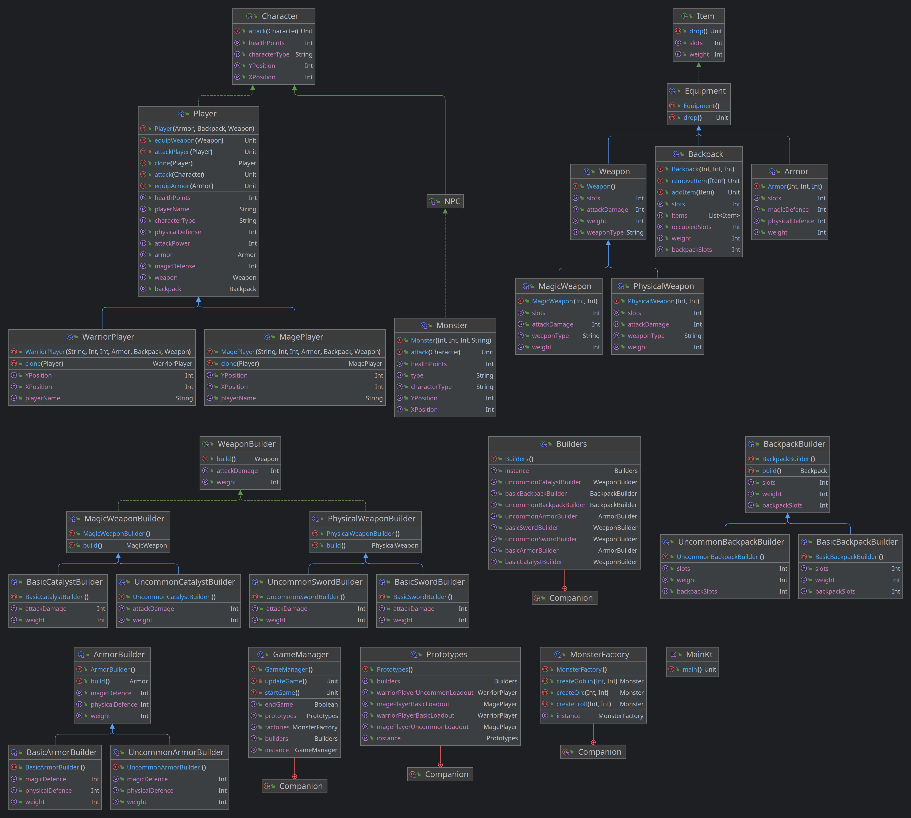

# Design Patterns


## Author: Corneliu Catlabuga

----

## Objectives:
* Study and understand the Creational Design Patterns. 
* Choose a domain, define its main classes/models/entities and choose the appropriate instantiation mechanisms.
* Use some creational design patterns for object instantiation in a sample project.


## Used Design Patterns:

* __Builder__: The builder pattern is used to create a complex object by using a step-by-step approach. The builder class
* __Factory__: The factory pattern is used to create objects without exposing the creation logic to the client and refer to newly created objects using a common interface.
* __Singleton__: The singleton pattern is used to restrict the instantiation of a class to one object.
* __Prototype__: The prototype pattern is used to create a duplicate object or clone of the current object to enhance performance.


## Implementation

### Builder Pattern
When calling the build class form the armor builder, the armor object is created with the specified parameters for the 
required kind of armor.
#### creationals.builders.ArmorBuilder.kt
```kotlin
abstract class ArmorBuilder
{
    abstract var physicalDefence: Int
    ...
    
    fun build(): Armor {
        return Armor(...)
    }
}
```


### Factory Pattern
When calling the createGoblin function from the monster factory, a new monster object is created with the specified parameters.
The factory pattern allows for the creation of different types of monsters, in this case the goblin and the orc.
#### creationals.factories.MonsterFactory.kt
```kotlin
class MonsterFactory
{
    ...
    
    fun createGoblin(...): Monster = Monster(...)
    ...
}
```


### Singleton Pattern
The singleton pattern is used to restrict the instantiation of a class to one object. In this case the game manager is a singleton, 
since multiple instances of the game manager would break the game logic.
#### creationals.singletons.Game.kt
```kotlin
class GameManager
{
    ...
    
    companion object
    {
        private val instance: GameManager? = null
    }

    fun getInstance(): GameManager
    {
        return instance ?: GameManager()
    }
    ...
}
```


### Prototype Pattern
The prototype pattern is used to create a duplicate object or clone of the current object to enhance performance and 
avoid multiple classes for concrete implementations.
#### creationals.prototypes.MonsterPrototype.kt
```kotlin
class Prototypes
{
    ...
    
    val magePlayerBasicLoadout: MagePlayer = MagePlayer(
        armor = builders.basicArmorBuilder.build(),
        backpack = builders.basicBackpackBuilder.build(),
        weapon = builders.basicCatalystBuilder.build(),
        playerName = "",
        xPosition = 0,
        yPosition = 0
    )
    ...
}
```

## Screenshots


