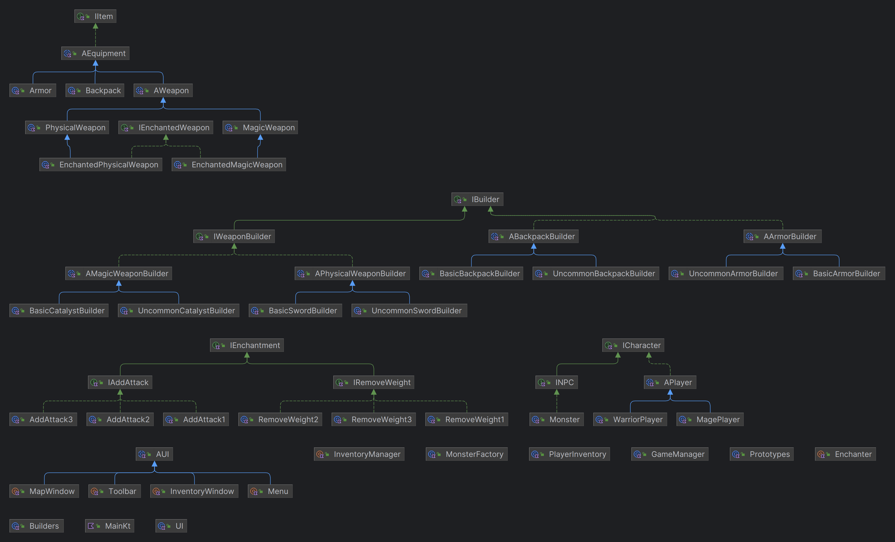

# Structural Design Patterns


## Author: Corneliu Catlabuga

----

## Objectives:

* Study and understand the Structural Design Patterns.
* As a continuation of the previous laboratory work, think about the functionalities that your system will need to provide to the user.
* Implement some additional functionalities, or create a new project using structural design patterns.


## Used Design Patterns:

* __Adapter__: The adapter pattern is used to provide a link between two otherwise incompatible types by wrapping the "adaptee" with a class that supports the interface required by the client.
* __Bridge__: The bridge pattern is used to separate the abstract elements of a class from the implementation details, providing the means to replace the implementation details without modifying the abstraction.
* __Facade__: The facade pattern is used to define a simplified interface to a more complex subsystem.
* __Decorator__: The decorator pattern is used to extend or alter the functionality of objects at run- time by wrapping them in an object of a decorator class. This provides a flexible alternative to using inheritance to modify behaviour.


## Implementation

### Adapter Pattern
#### patterns.structurals.adapter.Enchabter.kt
Takes in as parameters the weapon to be enchanted and the enchantments to be applied to it. The enchantments are applied to the weapon by calling the enchant method on each enchantment. It returns
an enchanted weapon with the same sub-stats as the original weapon and a list of enchantments.
```kotlin
object Enchanter {
    // Weapon -(adapt)-> EnchantedWeapon
    fun enchantWeapon(targetWeapon: AWeapon, enchantments: List<IEnchantment>): AWeapon {
        ...
    }
}
```

### Bridge Pattern
#### patterns.structurals.bridge.InventoryManager.kt
The inventory manager is a bridge for the player inventory class.
```kotlin
object InventoryManager {
    var playerInventory: PlayerInventory = PlayerInventory()

    fun getInventoryContent (): MutableMap<IItem, Int> {
        ...
    }

    fun getOccupiedSlots(): Int {
        ...
    }

    fun getTotalWeight(): Int {
        ...
    }

    ...
}
```

### Facade Pattern
#### patterns.structurals.facade.UI.kt
The UI class is a facade for the different UI elements. It allows for simultaneous hiding and showing of the UI elements.
```kotlin
class UI {
    var menu: Menu = Menu
    var mapWindow: MapWindow = MapWindow
    var inventoryWindow: InventoryWindow = InventoryWindow
    var toolbar: Toolbar = Toolbar
    ...
    
    fun show() {
        // Apply the previous state of the UI before hiding it
        ...
    }

    fun hide() {
        // Update the current state of the UI
        ...
    }
}
```

### Decorator Pattern
The EnchantedMagicWeapon class is a decorator for the MagicWeapon class. It adds the "Enchanted" prefix to the weapon type.
This is used for identifying enchanted weapons and apply status effects.
#### game.item.equipment.weapon.enchanted.EnchantedMagicWeapon.kt
```kotlin
class EnchantedMagicWeapon(...): MagicWeapon(...), IEnchantedWeapon {
    override fun getWeaponType(): String {
        return "Enchanted " + super.getWeaponType()
    }
}
```

## Conclusions / Screenshots / Results


