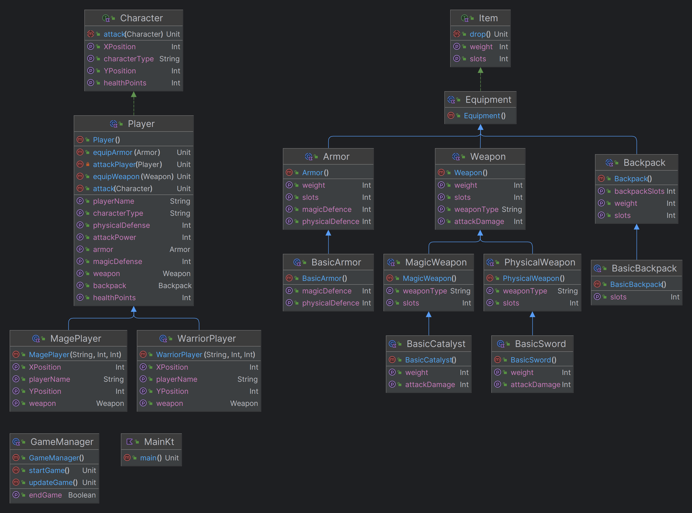

# Design Patterns


## Author: Corneliu Catlabuga

----

## Objectives:

&ensp; &ensp; 1. Study and understand the SOLID Principles.

&ensp; &ensp; 2. Choose a domain, define its main classes/models/entities and choose the appropriate instantiation mechanisms.

&ensp; &ensp; 3. Create a sample project that respects SOLID Principles.


## SOLID Principles:

* __Single Responsibility Principle__: In the case of players each class represents a chosen role in the game, each with 
characteristic abilities and limits. In this case the classes are: Mage (the player can only equip catalysts and deals 
magic damage) amd Warrior (the player can only equip swords and deals physical damage).

#### WarriorPlayer.kt
```kotlin
class WarriorPlayer(...): Player() {
    override var weapon: Weapon = BasicSword()
}
```

#### MagePlayer.kt
```kotlin
class MagePlayer(...): Player() {
    override var weapon: Weapon = BasicCatalyst()
}
```

* __Open-Closed Principle__: The classes are open for extension, but closed for modification. This is achieved by using
interfaces and abstract classes. The classes that implement the interfaces can be extended, for example the in a future
update the player can be extended to support trinkets which give stats like attack or defence, therefore the attack()
function would not require a modification.
    
#### Player.kt
```kotlin
abstract class Player (): Character {
    abstract var weapon: Weapon
    var armor: Armor = BasicArmor()
    var backpack: Backpack = BasicBackpack()

    var attackPower: Int = 0
    var magicDefense: Int = 0
    var physicalDefense: Int = 0

    init {
        this.attackPower += this.weapon.attackDamage
        this.magicDefense += this.armor.magicDefence
        this.physicalDefense += this.armor.physicalDefence
        // this.attackPower += this.trinket.attackDamage // future update
    }
    ...
}
```

* __Liskov Substitution Principle__: The classes that implement the interfaces can be used in place of the base class. For
example, the Mage class can be used in place of the Player class (however, due to the use of abstract classes it is not 
permitted).

* __Interface Segregation Principle__: The interfaces are designed to be as small as possible, so that the classes that
implement them are not forced to implement methods that they do not need. For example, the Character interface 
implements hp, xPos, yPos parameters and the attack() method, which is used by all the classes that implement it and 
will be used in other classes that inherit it.

#### Item.kt
```kotlin
interface Item {
    var slots: Int
    var weight: Int

    fun drop()
}
```

#### Character.kt
```kotlin
interface Character {
    var healthPoints: Int
    var xPosition: Int
    var yPosition: Int

    fun attack(target: Character)
    fun getCharacterType() : String
}
```

* __Dependency Inversion Principle__: The classes depend on abstractions, not on concretions. For example, the Player 
class depends on the Character interface, not on the Mage or Warrior classes. This allows the Player class to be used
with any class that implements the Character interface. In this case, the attack() method is used by both the Mage and 
Warrior classes.

#### Player.kt
```kotlin
private fun attackPlayer (target: Player) {
    ...
}
```

## Conclusions / Screenshots / Results


